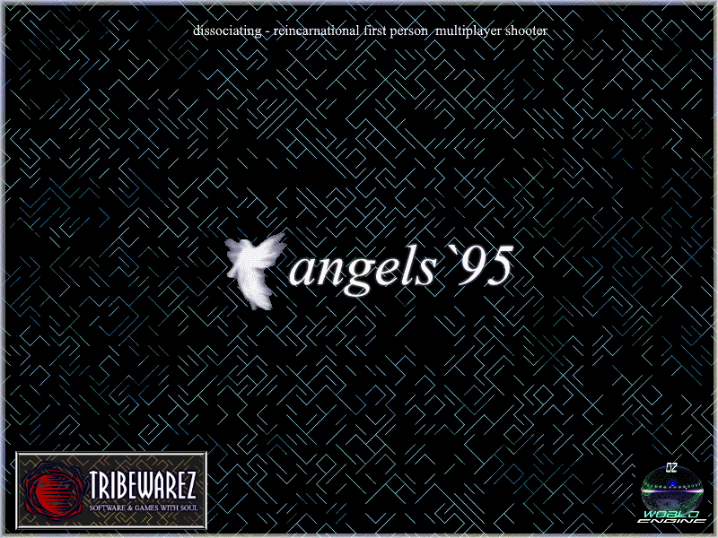

# OmegaTech Engine — Angels95 Edition



Angels95 reimagines the OmegaTech Engine as a **multiplayer game world** — a persistent, server-authoritative realm where players explore partitioned worlds, collect power-ups, level up, and fight NPCs alongside other connected players.

Built on [raylib](https://www.raylib.com/) with PS1-inspired retro aesthetics and a custom WDL world format.

---

## Quick Links

| Topic | Wiki Page |
|---|---|
| Gameplay, controls, HUD, mechanics | [Core Game](Wiki/Core-Game.md) |
| Architecture, source tree, key classes | [Engine Overview](Wiki/Engine-Overview.md) |
| AngelEd editor panels and workflow | [Editor Usage](Wiki/Editor-Usage.md) |
| LightningScript scripting reference | [LightningScript](Wiki/LightningScript.md) |
| WDL / OZONE world format | [World Format](Wiki/World-Format-WDL.md) |
| Build instructions, prerequisites, CI | [Building](Wiki/Building.md) |

---

## Client Controls

| Key | Action |
|---|---|
| WASD | Movement (first-person) |
| Mouse | Look |
| Left Click | Fire weapon (slot 1) |
| 1–8 | Select slot |
| Mouse Wheel / Arrow Keys | Cycle slots |
| E | Collect nearby pickup |
| Tab | Toggle inventory overlay |
| Escape | Pause menu (Resume / Settings / Main Menu / Quit) |
| F11 | Toggle fullscreen |

---

## Server Hosting

The dedicated server (`AngelServ`) has **no raylib dependency** and runs on any Linux or Windows machine.

```
./AngelServ --port 27015 --http-port 8080 --dir GameData
```

| Flag | Default | Description |
|---|---|---|
| `--port` | `27015` | UDP game server port |
| `--http-port` | `8080` | HTTP map API (`GET /map?list`, `GET /map?name=X`) |
| `--dir` | `GameData` | Path to game data directory |

The server scans `GameData/Worlds/` for subdirectories containing `World.wdl`. LAN discovery on UDP `27100`.

---

## License

MIT — see [LICENSE](LICENSE).

## Acknowledgments

- [raylib](https://www.raylib.com/) — Ramon Santamaria
- [raygui](https://github.com/raysan5/raygui) — Immediate-mode GUI
- [pl_mpeg](https://github.com/phoboslab/pl_mpeg) — MPEG1 video playback
- [c99-raylib-video-player](https://github.com/WEREMSOFT/c99-raylib-vide-player) — Video integration
