# Angels95 — OmegaTech Engine


Angels95 reimagines the OmegaTech Engine as a **multiplayer game world** — a
persistent, server-authoritative realm where players explore partitioned
worlds, collect power-ups, level up, and fight NPCs alongside other connected
players.

Built on [raylib](https://www.raylib.com/) 5.5 with PS1-inspired retro
aesthetics, a custom **OZONE** world format, a
**LightningScript** entity-scripting language, a Win32-native level editor
(`AngelEd`), and a dedicated standalone server (`AngelServ`) with no raylib
dependency.

Current release: **b82**.

---

## Showcase

All 12 shots captured in-engine via `--shot` mode (PS1-style, HUD-free,
1920x1060) across the four shipped worlds.

### Citadel Ruins

A ruined hill-citadel — roofed courtyard, four corner towers, a gatehouse
over the south gate, and watch balconies over a collar of sand.

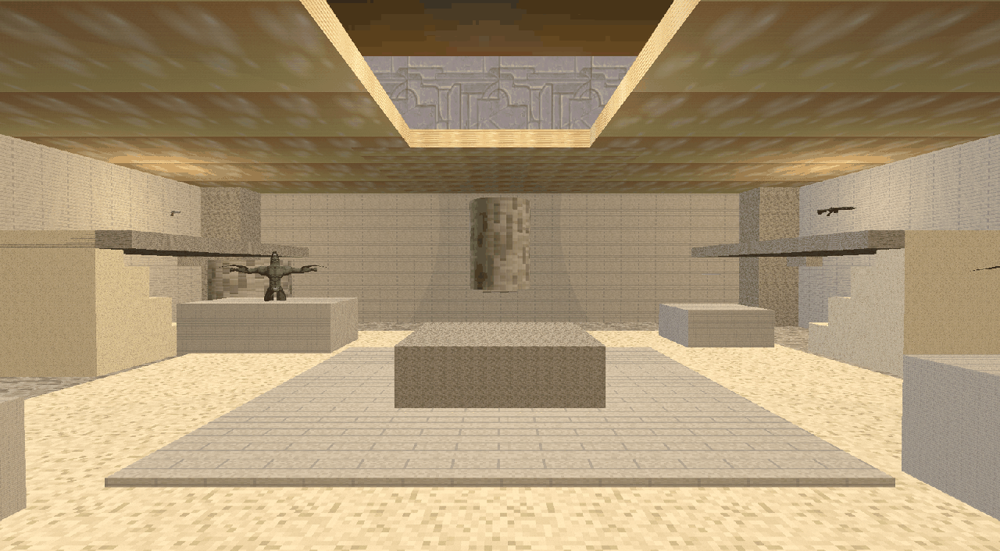
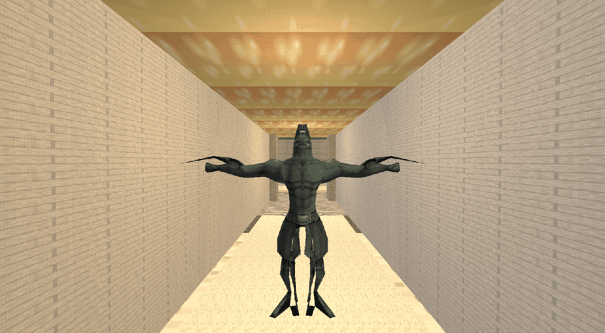
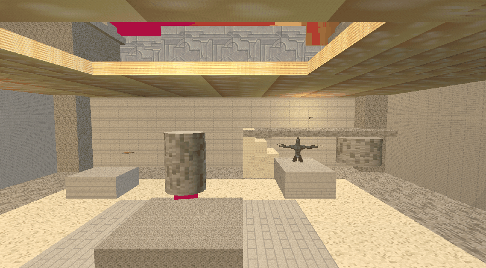

### Dessert Dreams

Sun-baked desert oasis at midday — sandstone arches and columns under a noon
sky.

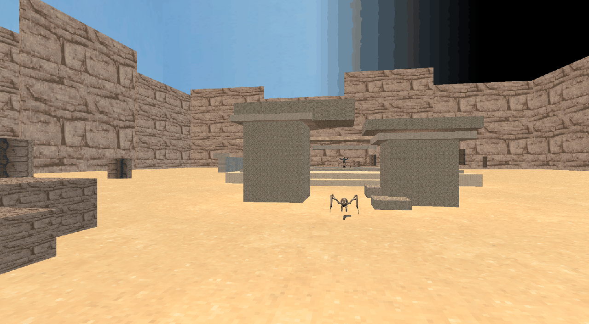
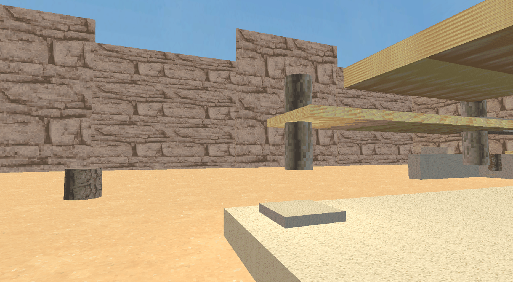
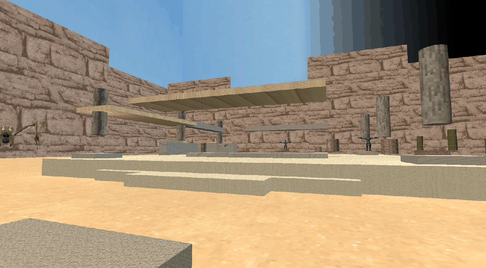

### Dust Ravine

Desert fortress — halls, corridors, underground tunnels and three outdoor
areas under a daylight sky.

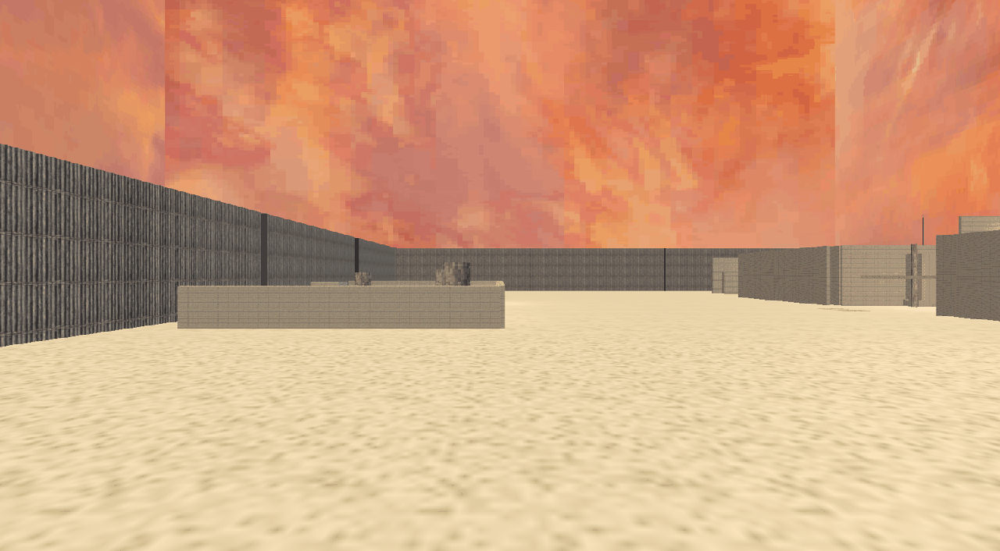
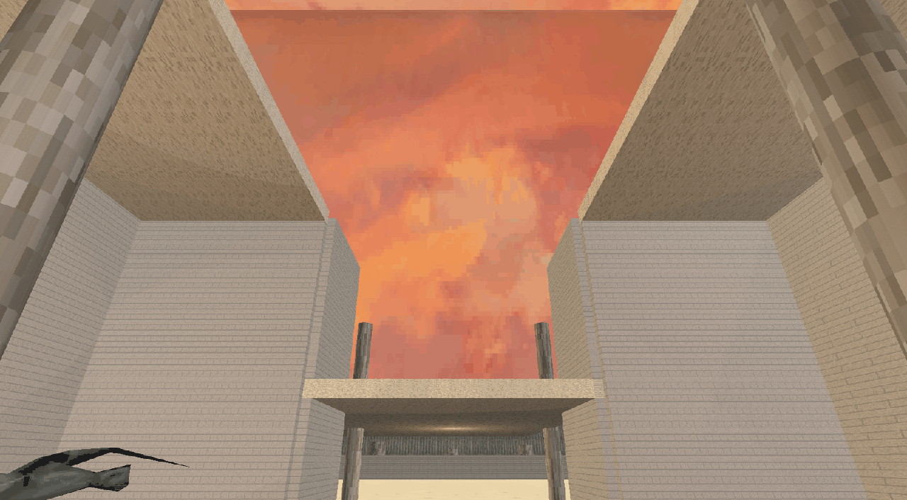
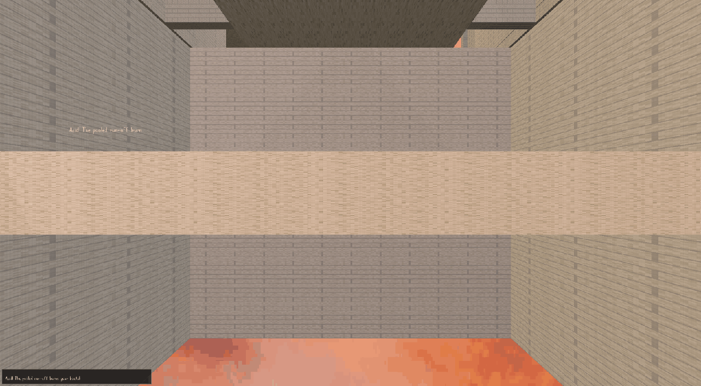

### Engine Test

Small functional/test scene — five chambers, a great hall and a courtyard,
one zone of every zone type, and a portal to Dust Ravine.

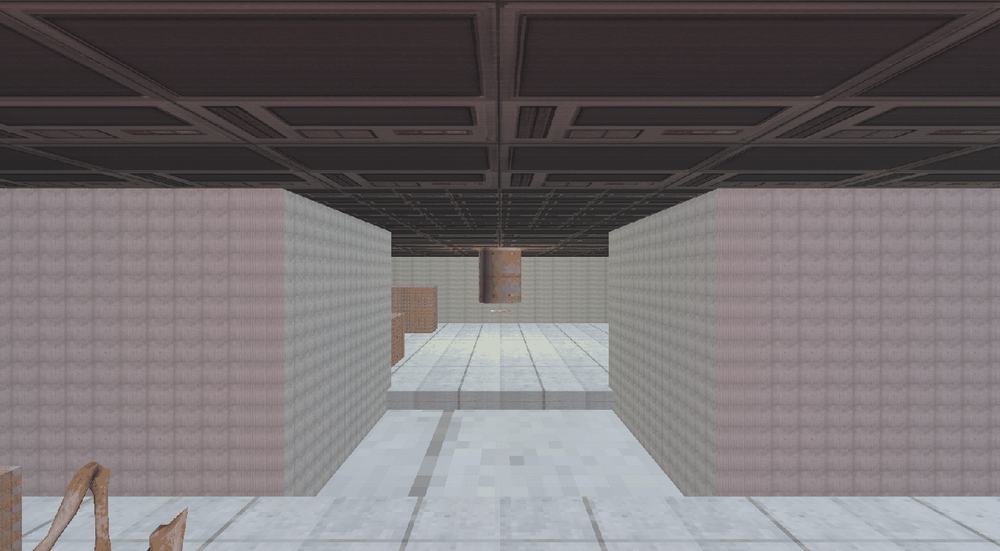
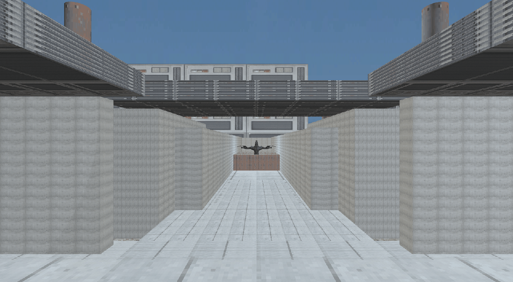
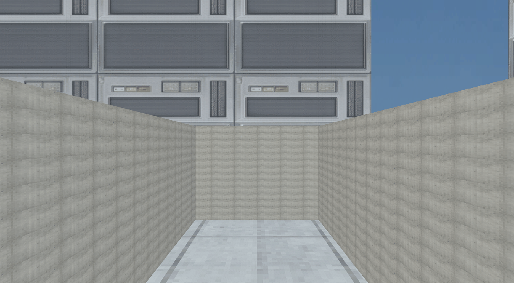

---

## Features

- **Dedicated server** — UDP multiplayer, HTTP map API and `/status`, LAN
  discovery (UDP `27100`) plus internet discovery via `AngelMaster` heartbeats;
  runs headless on Linux or Windows.
- **CSG worlds** — `OZONE` primitive brush format (`add`/`sub`/`intersect`,
  box/cyl/sph/pyr/pln), per-brush `texScale*`/`texOffset*`/`texPath` and
  `name=` zone labels.
- **LightningScript entities** — data-driven `.ozls` definitions for items,
  pickups, weapons, NPCs, and scripted sky/zone triggers (`on_enter`,
  `on_tick`, `on_collect`, …) with actions like `heal`, `damage`, `msg`,
  `consume`, `playerstat`, `spawn_pickup`, `spawn_pawn`.
- **Data-driven pawn system** — NPC defs in `GameData/Global/PawnDefs/*.cfg`
  with an IDLE/PATROL/CHASE/RETURN/DEAD state machine.
- **Weapons & combat** — ranged (projectiles, ammo/reload/magazine) and melee
  (`reach`, `on_swing`/`on_hit`) defined as `.ozls` entities.
- **AngelEd level editor** — native Win32 panels + raylib viewport, CSG brush
  ops, OZONE export, Lit/Unlit/Wire view modes.
- **Packaged assets** — `OzPack.exe` bundles models/scripts/textures/sounds/
  worlds into `.ozpak/.oztex/.ozsnd/.ozmux/.ozone` packages in `System/Data/`.
- **GameUI object-bar HUD (b82)** — `SlotBar` renders a data-driven atlas +
  slots with click-to-select; shared between the in-world hotbar and the
  inventory overlay.
- **AngelPlayer behaviours (b78–b80)** — `GameUi`, `InventoryBehaviour`,
  `WeaponBehaviour`, `PlayerController` modules; sprint/crouch/stance
  replicated to the server.
- **Per-zone physics (b80)** — `gravity`, `jump`, `terminal`, `water_*`,
  `ladder_speed`, `fly_mult` overrides via `ZoneEnvOverrides`.
- **Unified audio (b57/b82)** — `SoundManager` facade for every sound/music
  call; `DspReverb` Schroeder reverb on the master mix.
- **Server worlds & saves (b59)** — seeds NPCs/pickups from `World.ozone`;
  V2 world saves with 60s autosave; HTTP `/map` API; admin `list`/`say`/`kick`
  + HTTP Bearer auth.
- **HTTPS master uplink (b59/b70)** — WinHTTP/Schannel (Windows) + curl
  (POSIX), no vendored crypto; default master
  `https://angels95.tribewarez.com/master`; LAN + Internet browser.
- **Editor undo/redo (b60–b81)** — full-document history (Ctrl+Z/Y/Shift+Z),
  OZONE save/playtest, Script Manager, def-aligned Entity Properties, world
  texture import, viewport skybox.
- **Vertex-keyframe animation (b74)** — `.ozanim` morph clips, in-editor
  animation tool, Convert to Animated, vertex deform + undo/redo.
- **New OZONE entities (b74)** — `Mesh.Static`/`Mesh.Skeletal`,
  `ParticleEmitter`, `PathNode`, `WindZone` end-to-end (OZONE → loader →
  runtime → editor → export) with wind-sway shader.
- **Weapons & view-models (b54+)** — six shipped weapons; FBX→GLB pipeline;
  per-weapon first-person view-model with Idle/Fire/Reload clips + procedural
  recoil.
- **Screenshot mode (b82)** — `--shot`, `--shot-delay`, `--shot-res`,
  `--shot-cam`, `--shot-hud` headless captures.
- **Deep-link join (b60/b71)** — `angels95://join/<ip>:<port>` OS protocol
  handler (HKCU / `.desktop`) with `JoinUri` validation.
- **Pack-on-import (b82)** — editor imports pack straight into
  `imported_models.ozpak` / `imported_textures.oztex` (free-placement
  textures, not tileset).

---

## Quick Links

| Topic | Page |
|---|---|
| Quick developer reference | [AGENTS.md](AGENTS.md) |
| Gameplay, controls, HUD, mechanics | [Core Game](Wiki/Core-Game.md) |
| Architecture, source tree, key classes | [Engine Overview](Wiki/Engine-Overview.md) |
| AngelEd editor panels and workflow | [Editor Usage](Wiki/Editor-Usage.md) |
| LightningScript scripting reference | [LightningScript](Wiki/LightningScript.md) |
| OZONE world format | [World Format](Wiki/World-Format-OZONE.md) |
| Build instructions, prerequisites, CI | [Building](Wiki/Building.md) |
| Gap analysis and priorities | [Engine Roadmap](Wiki/Engine-Roadmap.md) |
| Master server protocol, HTTPS uplink, browser | [Master Server](Wiki/Master-Server.md) |

---

## Client Controls

| Key | Action |
|---|---|
| WASD | Movement (first-person) |
| Mouse | Look |
| Left Click | Fire weapon (slot 1) |
| 1–8 | Select hotbar slot |
| Mouse Wheel / Arrow Keys | Cycle slots |
| E | Collect nearby pickup |
| Tab | Toggle inventory overlay |
| Escape | Pause menu (Resume / Settings / Main Menu / Quit) |
| F11 | Toggle fullscreen |

---

## Running

### Server

The dedicated server has **no raylib dependency**:

```
./AngelServ --port 27015 --http-port 8080 --dir GameData
```

| Flag | Default | Description |
|---|---|---|
| `--port` | `27015` | UDP game server port |
| `--http-port` | `8080` | HTTP map API (`GET /map?list`, `GET /map?name=X`) and `/status` |
| `--dir` | `GameData` | Path to game data directory |
| `--server-name` | `Angels95 Server` | Display name announced to masters |
| `--master` | – | Master UDP heartbeat target `host[:port]`, repeatable |
| `--master-http` | – | Master HTTP(S) heartbeat URL, repeatable (TLS via WinHTTP/curl) |
| `--public-ip` | – | Public IP to announce when behind NAT |
| `--bind` | all | Interface to bind — IPv4, hostname, or `0.0.0.0` on a VPS |
| `--auth-token` | – | HTTP Bearer gate (env `OZ_AUTH_TOKEN`) |
| `--admin-token` | – | Enables COMMAND list/say/kick (env `OZ_ADMIN_TOKEN`) |

LAN discovery on UDP `27100`. Worlds are scanned from `GameData/Worlds/`.

### Master server

`AngelMaster` maintains the public server list for internet browsing:

```
./AngelMaster --port 27900 --http-port 27950
```

It accepts UDP heartbeats and `POST /api/heartbeat`, and serves
`GET /api/servers?gamename=angels95` (JSON, CORS-enabled). Entries expire after
90 s. Point game servers at it with `--master host:27900` and/or
`--master-http http://host:27950`; clients add it to `[MasterServers]` in
`System/Angels95.ini` and browse via **Multiplayer → Join → Source: Internet**.
See [`Wiki/Master-Server.md`](Wiki/Master-Server.md) for the full protocol.

### Client

Launch the client from the repo root (it expects repo-relative asset paths) or
from a `System/` release folder:

```
./Angels95                # show home screen / load default world
./Angels95 --world Dust_Ravine
./Angels95 --world-dir GameData/Worlds
```

> Note: `System/Angels95.ini` **is read at runtime** by the client (`[Settings]`,
> `[MasterServers]`); `System/OzServer.ini` is a template written by the build
> scripts, and `AngelServ` also reads it at runtime (`[Server]`/`[Auth]`/
> `[MasterServers]`) — CLI flags and env (`OZ_AUTH_TOKEN`, `OZ_ADMIN_TOKEN`)
> override it.

---

## Building

### Linux / macOS

raylib 5.5 must be installed system-wide (`/usr/local/lib/libraylib.a` —
`build.sh` installs it from source). Then:

```bash
make OTENGINE       # client -> Angels95
make AngelServ      # server, no raylib
make AngelMaster    # master server, no raylib
make ozpack         # asset packer
make -j$(nproc)     # all four
```

### Windows

- **w64devkit:** `.\build-native-win.ps1` (requires `C:\raylib\w64devkit`).
- **MSYS2 / MINGW64:** `.\build.ps1` (auto-builds raylib 5.5 if missing).

Both assemble a playable `System/` folder. `build-data.ps1` drives `OzPack`
to create `.oz*` packages from `GameData/`.

### Targets

| Target | Build cmd | Depends on |
|---|---|---|
| `Angels95` client | `make OTENGINE` | raylib 5.5 |
| `AngelServ` server | `make AngelServ` | none (standalone sockets) |
| `AngelMaster` master | `make AngelMaster` | none (standalone sockets + threads) |
| `AngelEd` editor | `make -C AngelEd` | raylib + Win32 (Windows only) |
| `OzPack` packer | `make ozpack` | none |

---

## Tests

```bash
make test   # builds + runs all suites, continues past failures
```

Standalone tests (no framework) land in the repo root as executables.
Suites: parser, context, registry, entity_manager, pawn_system,
ozone_parser, join_uri, master, network, game_state. Single suites:
`make test_parser`, etc.

---

## Documentation & Repository Structure

- `Source/` — client core, renderer, network, server, master server
  (`Source/Master/`), script, pawn, physics, package, audio, video (`plmpeg`).
- `AngelEd/` — Win32 level editor.
- `GameData/` — worlds, pawn defs, items, guns, textures, sounds.
- `tests/` — standalone test executables.
- `Wiki/` — full engine documentation (see Quick Links above).

---

## Changelog

### b82 — 2026-10-01
- GameUI object-bar HUD (`SlotBar`) — data-driven atlas + `slot_rects`, click-to-select, shared between in-world hotbar and inventory overlay; editor asset-scope tree + pack-on-import; `SoundManager`/`ZoneManager` extraction; `--shot` screenshot mode; new pawn/player assets.

### b81 — 2026-09-30
- Editor full-document undo/redo (OZONE-snapshot history) + world texture import; tileset-aware `OzoneLoader::LoadString`; CitadelRuins south corridor + Skaarj Predator model.

### b80 — 2026-09-30
- AngelPlayer behaviour modules (`GameUi`, `InventoryBehaviour`, `WeaponBehaviour`, `PlayerController`) + `PlayerPhysics`; per-zone physics overrides via `ZoneEnvOverrides`; native UI.

### b79 — 2026-09-30
- Client lighting fixes (headlight wash, editor light export), pistol pickup crash, inverted controls; equipment wiring + skill respec + stance replication.

### b78 — 2026-09-30
- Player model, `movement_speed` + sprint/crouch, ethereal skill tree, equipment wiring, multiplayer stance.

### b77 — 2026-09-30
- Source tree reorganized (`World/`, `Pawn/AngelPlayer/`, `Renderer/Mesh/`, `Audio/`); legacy WDL format dropped.

### b76 — 2026-09-30
- Model Browser preview fixed; Import/Export mesh buttons restored.

### b75 — 2026-09-30
- raylib 5.5 CI build fix; editor list de-dup, resizable panels, button icons.

### b74 — 2026-09-30
- `oz::Mesh` taxonomy (static/skeletal + vertex-keyframe `.ozanim` animation); new OZONE entities `ParticleEmitter`, `PathNode`, `WindZone` end-to-end; in-editor animation authoring tool.

### b73 — 2026-09-28
- Network NPC sync fix — server NPCs keyed by (world, npc, partition); no more unbounded pawn spawning after a map switch.

### b72 — 2026-09-28
- Joining a server now loads its map (menu `GetSelectedWorld` + server `active_world` JSON fixes); client relocates cwd to the install root.

### b71 — 2026-09-28
- Join-IP textbox corruption fixed; packaged `.dds`/image/audio decode from memory (`LoadImageFromMemory`/`LoadWaveFromMemory`).

### b70 — 2026-09-28
- Live HTTPS master uplink — WinHTTP/Schannel (Windows) + curl (POSIX), no vendored crypto; default master `https://angels95.tribewarez.com/master`; working Internet server browser.

### b69 — 2026-09-28
- Per-binary release assets on GitHub (Linux + Windows); release notes document standalone vs zip-required binaries.

### b68 — 2026-09-28
- Saved levelinfo skybox renders in client + editor; level skybox beats zone texture (explicit `set_skybox` still overrides).

### b67 — 2026-09-28
- Skybox actually loads (lazy `skyboxTex`); per-world `.ozls` skybox fallback; Sky toolbar toggle restored.

### b66 — 2026-09-28
- Editor skybox selection priority fixed (levelinfo > `Models/Skybox.png`).

### b65 — 2026-09-28
- Linux server build fixed; `--bind` on AngelServ/AngelMaster for VPS hosting; anti-spoof `publicip` trust; `System/angels95-serv.service` units.

### b64 — 2026-09-28
- Editor viewport skybox cube + Sky toolbar toggle.

### b63 — 2026-09-28
- Skybox packaging (`.dds` from packages via `System/Cache`); texture manager lists the `.dds` sky library.

### b62 — 2026-09-28
- Zone Properties tabs visible again (Particles/Portals wired); Fog skybox Browse/Use Active Tex/Apply Skybox.

### b61 — 2026-09-28
- OZONE texture persistence + editor load idempotence; AngelMaster daemon + InternetBrowser + master announce; Master wiki/test/CI.

### b60 — 2026-09-28
- Editor OZONE save/playtest fixed (compiles before launch); Script Manager; def-aligned Entity Properties; `angels95://` deep-link + `JoinUri`.

### b59 — 2026-09-27
- LightningScript VM made real (flag vars, RHS arithmetic, brace conditions, `toggle_flag`/`jump`); pawn FSM hooks live; server world seeding + V2 saves + admin/auth.

### b58 — 2026-09-26
- Multiplayer wiring: scene/ammo sync, weapon grants, typed network NPCs; NPC death/respawn; pickup respawn; CSG op export; portal traversal; editor tool modes.

### b57 — 2026-09-26
- Wired dead systems: reverb DSP on master mix, pawn aggro screams, looping title video, LAN browser + join/host ports, OzPackage zlib compression.

### b56 and earlier — historical record

- **b56 — 2026-09-24** — Tier 0 network security hardenings: world-list clamp, bounded reads, server-authoritative `PLAYER_HURT`/`PLAYER_KILL`, ammo clamps, teleport rejection, deferred auth.
- **b55 — 2026-09-23** — LightningScript entity actions (`msg`/`heal`/`damage`/`playerstat`/`consume`/`spawn_pickup`); Dust_Ravine content; AngelEd brush ops; CombatFX; CI overhaul.
- **b54 — 2026-08-21** — OZONE terrain render pipeline, sky zone isolation, script action boundaries.
- **b53 — 2026-08-11** — New map Dust_Ravine (desert fortress); 2x wall texture tiling; `texScale*` tokens.
- **b52 — 2026-08-11** — Fix: `EngineBillboard` model-cache (extreme low FPS).
- **b51 — 2026-07-30** — Crash fixes, server security, multiplayer UI, editor fixes, refactoring, tests.

---

## License

[MIT](LICENSE) — Copyright (c) 2026 TribeWarez.

See also [CODE_OF_CONDUCT.md](CODE_OF_CONDUCT.md),
[CONTRIBUTING.md](CONTRIBUTING.md), and [SECURITY.md](SECURITY.md).

## Acknowledgments

- [raylib](https://www.raylib.com/) — Ramon Santamaria
- [raygui](https://github.com/raysan5/raygui) — Immediate-mode GUI
- [pl_mpeg](https://github.com/phoboslab/pl_mpeg) — MPEG1 video playback
- [c99-raylib-video-player](https://github.com/WEREMSOFT/c99-raylib-vide-player) — Video integration