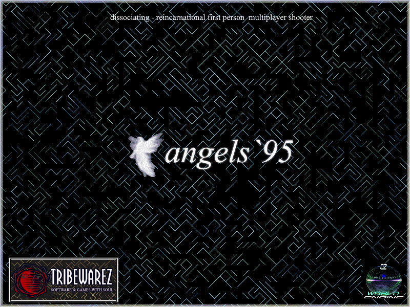

# Angels95 — OmegaTech Engine

Angels95 reimagines the OmegaTech Engine as a **multiplayer game world** — a persistent, server-authoritative realm where players explore partitioned worlds, collect power-ups, level up, and fight NPCs alongside other connected players.

Built on [raylib](https://www.raylib.com/) 5.5 with PS1-inspired retro aesthetics and a custom OZONE world format. Current release: **b82**.

The player is an **AngelPlayer** built from behaviour modules (GameUi bridge, InventoryBehaviour, WeaponBehaviour, PlayerController); the **SlotBar** object-bar HUD renders a data-driven atlas with click-to-select. **ZoneManager** owns zone volumes, portals and environment overrides; **SoundManager** is the single facade for every sound/music call; the menu's Internet browser talks to the official HTTPS master; and `--shot` captures deterministic in-engine screenshots.

## Showcase

In-engine `--shot` renders across the four shipped worlds:

## Contents

| Page | Description |
|---|---|
| [Core Game](Core-Game) | Gameplay mechanics, controls, HUD, inventory, save system |
| [Engine Overview](Engine-Overview) | Architecture, source tree, key classes, package system |
| [Editor Usage](Editor-Usage) | AngelEd panels, toolbar, CSG, workflow, known gaps |
| [LightningScript](LightningScript) | Scripting language reference, opcodes, entity definitions |
| [World Format (OZONE)](World-Format-OZONE) | OZONE syntax and world directory layout |
| [Building](Building) | Build instructions, prerequisites, test targets, CI |
| [Engine Roadmap](Engine-Roadmap) | Gap analysis and prioritized roadmap by tier |
| [Master Server](Master-Server) | Master server protocol, HTTPS uplink, client browser |
